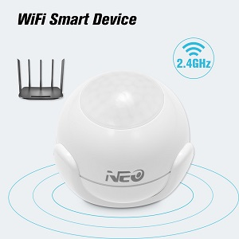
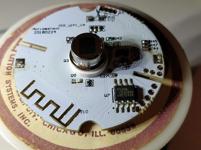
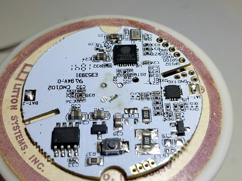

ESPHome WiFi PIR Sensor Support
===============================

Work-in-progress support for WiFi PIR sensors built on the Tuya platform. They seem to be manufactured by SHENZHEN NEO ELECTRONICS CO.,LTD, but are resold and rebadged by several other vendors. All devices I've seen share FCC ID [Z52NAS-PD01W0](https://fccid.io/Z52NAS-PD01W0).

Overview
--------

These devices embed an ESP8266 wifi processor paired with a Silicon Labs [EMF8 'Sleepy Bee' SB1](https://www.silabs.com/products/mcu/8-bit/efm8-sleepy-bee) ultra-low-power coprocessor. The SB1 and ESP8266 communicate via serial UART at 9600 bps. The SB1 controls the LEDs, PIR sensor, and gates power to the ESP8266 when it is not needed.

These devices have been documented a few places; this is the first attempt that I am aware of to document the protocol and provide alternate firmware.
* https://github.com/esphome/esphome/issues/306
* https://community.home-assistant.io/t/coolcam-wifi-motion-sensor-pir/54783
* https://www.aliexpress.com/wholesale?SearchText=coolcam+white+wifi+pir
* https://www.amazon.com/Wasserstein-Smart-Enabled-Motion-Sensor/dp/B07FXBB2HP (maybe - have not tried it myself)

| [Product Image](images/product.jpg?raw=true)| [PCB Top](images/pcb-top.jpg?raw=true)| [PCB Bottom](images/pcb-bottom.jpg?raw=true)|
|---------------------------------------------|---------------------------------------|---------------------------------------------|
|       |       |       |

Initial Flashing
----------------

You will need a USB-TTL converter, some small probe clips, and a 3.3v supply. The device can be powered off the battery, but I prefer to use an external supply. You must at least remove the battery before connecting everything in order to get the ESP into the bootloader.


1.  Install esphome 1.11 or better
2.  Copy `substitutions.yaml.example` to `.substitutions.yaml` and edit to add your wifi and broker settings
3.  Run `esphome pir.yaml compile`
4.  Twist off the back of your PIR sensor; remove the battery and the two screws retaining the front cap.
5.  Connect probes to the GPIO0, RXD0, TXD0, and GND contacts (see image at right).
6.  Connect GPIO0 to GND.
7.  Connect your 3.3v supply, or insert the battery. The LEDs should blink quickly and then go out. The ESP is now online in bootloader mode, with approximately 120 seconds until the it is powered down by the coprocessor. If you wait too long, just pull the power and start over.
8.  Conect your TTL serial device to the RXD0, TXD0, and GND probes.
9. Run `esphome pir.yaml upload` and select your serial port. If the upload fails, check that you connected everything in the proper order. In particular, having the serial device connected before powering up the ESP will prevent it from entering the bootloader. If in doubt, disconnect the power and serial converted and start over at step 7.
10. Disconnect everything and reassemble the sensor.
11. Insert the battery, and hold down the button until the LED goes solid and then begins flashing. The ESP is now running esphome, and is in OTA mode.
12. Wait approximately 35 seconds for the device to reboot into normal mode. It should now function normally.

OTA Updates
-----------

Once the device is operational, it will only be on the network for a few milliseconds when motion events are detected. In order to hold it online long enough to perform an OTA update, open up the back of the sensor and hold down the button until the LEDs begin blinking continuously. You now have 30 seconds to initiate an OTA update. The LEDs will continue blinking until the device has completed the update and rebooted into normal mode.

If the device does not detect motion after an OTA update, remove the battery and wait about 30 seconds. Reinsert the battery, hold down the button until the LEDs begin blinking, and wait approximately 35 seconds for OTA to time out and reboot. It should now function normally.


Replacing The Battery
---------------------

The device should report the battery voltage to Home Assistant. When it gets too low (down to about 2.5 volts?) it should be replaced. After replacing the battery,  hold down the button until the LEDs begin blinking, and wait approximately 35 seconds for OTA to time out and reboot. It should now function normally.

The manual suggests that 1500 mAh battery is good for about 18,000 events (motion + clear * 25 per day * 365 days) with the stock firmware. I haven't validated this or compared stock firmware to esphome, but obviously more time spent online (lots of events, OTA, etc) will drain it faster.

Serial Protocol Overview
------------------------

These are the message I have seen the two processors exchange during limited bench testing. There may be more.

The protocol is a simple type-length-value sequence, with a fixed header and trailing 1-byte modulo-265 sum of the previous bytes, including the header. It looks something like this:

```C
// longs are sent in network byte order
struct SB1Message {
  uint16_t header;  // Fixed: 0x55AA
  uint16_t type;
  uint16_t length;
  uint8_t value[];   // Variable length; not terminated
  uint8_t checksum;  // Sum of all previous bytes, modulo 256
};
``` 

Handshake
---------

The first message is always a product ID request from the ESP to the SB1.

The `0x00 0x01` type code is used by both the request and response.

**Product ID Handshake:**
```
ESP8266 -> SB1: 55 AA 00 01 00 00 00
SB1 -> ESP8266: 55 AA 00 01 00 ${"P":"Okurono2XLVRV0fB","v":"1.1.0"} 19
```

Configuration Status
--------------------

After handshaking, the sequence may go to one of three different paths as the ESP8266 is configured by the smartphone app and connnects to the cloud service.

The `0x00 0x02` type code is used by all status messages and responses.

**WiFi SmartConfig AP (Fast Blink) Mode:**
```
ESP8266 -> SB1: 55 AA 00 02 00 01 00 02
SB1 -> ESP8266: 55 AA 00 02 00 00 01
```

**Wifi SmartConfig STA (Slow Blink) Mode:**
```
ESP8266 -> SB1: 55 AA 00 02 00 01 01 03
SB1 -> ESP8266: 55 AA 00 02 00 00 01
```

**Normal (Configured) Mode:**
```
# WiFi Connected
ESP8266 -> SB1: 55 AA 00 02 00 01 02 04
SB1 -> ESP8266: 55 AA 00 02 00 00 01

# IP Address Received from DHCP
ESP8266 -> SB1: 55 AA 00 02 00 01 03 05
SB1 -> ESP8266: 55 AA 00 02 00 00 01

# Connected to MQTT
ESP8266 -> SB1: 55 AA 00 02 00 01 04 06
SB1 -> ESP8266: 55 AA 00 02 00 00 01
```

In Configured mode, if no motion event has been detected, the ESP8266 will be powered down approximately 3.5 seconds after the final status message is ackd by the SB1. In either SmartConfig mode, the ESP8266 will be powered down after aproximately 110 seconds.

Motion events will only be fired if the device has gone to sleep after being successfully configured. If the SB1 does not see a successful configuration sequence, the ESP8266 will stay asleep until the reset button is held to re-initiate autoconfiguration. I'm not sure what happens if WiFI or internet access is unavailable following successful configuration; this has yet to be tested.

Configuration Reset
-------------------

The SB1 may send a reset command to the ESP8266 at any time. This is triggered by holding down the button inside the device as described in the user manual. The Tuya firmware responds by removing all WiFi and Tuya configuration, and rebooting into SmartConfig mode. Repeated messages are used to toggle the device between STA and AP mode for SmartConfig. The SB1 does not seem to care if you ack this or not; it expects the ESP8266 to reboot anyway.

The `0x00 0x03` type code is used by all status messages and responses.

```
SB1 -> ESP8266: 55 AA 00 03 00 00 02
ESP8266 -> SB1: 55 AA 00 03 00 00 02
```

Unknown Event
-------------

I would expect there to be a message with type code `0x00 0x04`, but I have not yet seen it.

Motion Event
------------

If the ESP8266 was powered up due to a motion event, the ack to the 'Connected to MQTT' message will be immediately followed by a motion detection message. The ESP8266 will be powered down immediately after acking the motion detection message. The message should NOT be ackd until whatever notification you're going to send has been successfully transmitted. 

Motion detection will not fire more than once per boot of the ESP. The payload indicates motion state, and something else?
* `65 01 00 01 01`  - Motion detected
* `65 01 00 01 00`  - Motion cleared
* `66 04 00 01 03`  - Unknown; follows one of the `65` sequences on the first motion event following power up

The `0x00 0x05` type code is used by all motion messages and responses.

```
SB1 -> ESP8266: 55 AA 00 05 00 05 65 01 00 01 00 70
ESP8266 -> SB1: 55 AA 00 05 00 01 00 05
```

SB1 Desync
----------

In order to send motion events, the SB1 coprocessor needs to see the ESP boot successfully all the way to the 'Connected to MQTT' state. Once this is done, it will put the ESP to sleep until motion is detected. If it does not see the correct boot sequence, it will not detect motion and will never wake the ESP.

Normally the ESP can cycle through reset(OTA) and normal modes without issue, but it seems that sometimes the SB1 gets confused about what state the ESP is in, and will refuse to wake the ESP even after a successful boot sequence. If this occurs, it is necessary to reset the SB1 by removing the battery for 20-30 seconds, and then reinsert it and run the ESP through a reset/normal boot sequence. Once that is done it should function normally again.
